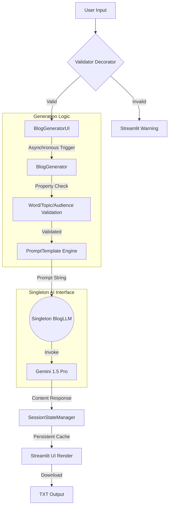

# 🌟 Enterprise Blog Intelligence Engine

An asynchronous, state-of-the-art **LLM-driven Content Generator** that utilizes advanced Pythonic design patterns to produce tailored long-form content. Built with **LangChain** and **Gemini 1.5 Pro**, this application prioritizes structural integrity, thread safety, and scalable architecture.

---

## 🏗️ System Architecture

The application is engineered using a **Layered Singleton Architecture**, ensuring efficient resource management and a clean separation between the UI and the underlying AI logic.

### 1. Logic & Design Patterns
* **Singleton Metaclass:** The `BlogLLM` interface uses a metaclass-based Singleton pattern to prevent redundant initialization of the heavy LLM model, optimizing memory footprint.
* **Dependency Injection:** The `BlogGenerator` class receives the LLM interface via constructor injection, allowing for high testability and modular swapping of AI backends.
* **Property Decorators:** Implements strict data validation for word counts and audience types using `@property` and `@setter` patterns to catch errors before API invocation.

### 2. Async Orchestration Layer
* **Event-Loop Management:** Uses `asyncio` to handle LLM calls without blocking the Main Thread, ensuring a responsive Streamlit UI during long content generation cycles.
* **Concurrency Control:** Leverages `asyncio.to_thread` to bridge the gap between synchronous Streamlit callbacks and asynchronous LangChain invokers.

### 3. Context & State Management
* **Session State Manager:** A custom context manager (`__enter__`/`__exit__`) abstracts Streamlit’s `session_state`, ensuring generated content persists across UI interactions without manual state setting.
* **Input Validation Decorator:** Uses a high-order function (`@validate_input`) to enforce business logic on UI actions, decoupling validation logic from the primary generation method.

---

## 🛠️ Tech Stack

| Component | Technology |
| :--- | :--- |
| **Generative AI** | Google Gemini 1.5 Pro (LangChain) |
| **Framework** | Streamlit (Async Integration) |
| **Schema Validation** | Pydantic (Settings & Config) |
| **Design Patterns** | Singleton, Decorators, Context Managers |
| **Async Engine** | AsyncIO |

---

## 🧠 System Logic Flow



---

## 📊 Technical Specifications

### Data Modeling & Integrity
The system uses **Pydantic** for configuration management, allowing the model name and logging levels to be strictly typed and environment-aware.

### Error Handling & Logging
A custom `BlogError` exception hierarchy combined with Python’s `logging` module ensures that API failures or logic errors are captured with full stack traces without exposing sensitive details to the end-user.

### Prompting Strategy
Uses **Dynamic Template Injection** via LangChain's `PromptTemplate`:
```python
template = "Write a {num_words}-word blog for {audience} about {topic}."
```
This ensures the LLM receives structured instructions, minimizing the "creative drift" and maximizing relevance for the target audience (Researchers, Data Scientists, or Common People).
